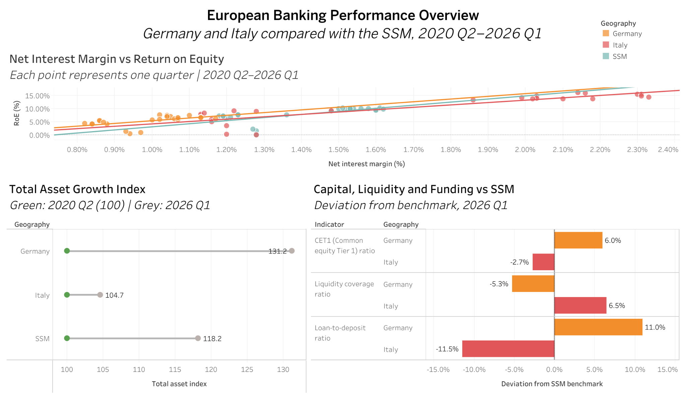
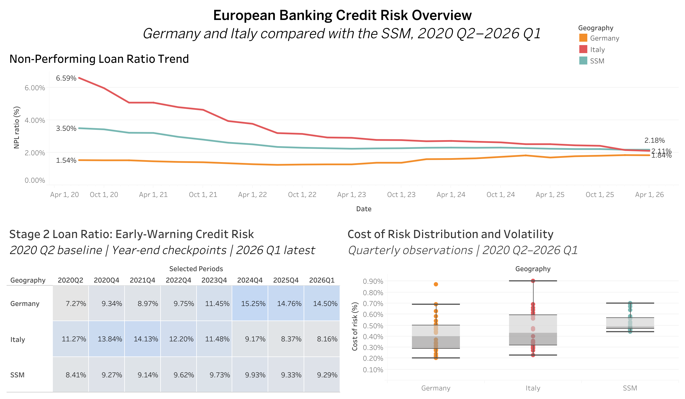

# European Banking Performance and Credit Risk

## About this project

I built this Tableau project to examine how significant banks in Germany and Italy performed relative to the Single Supervisory Mechanism, or SSM.

The analysis covers 24 quarters, from 2020 Q2 to 2026 Q1. I looked at credit quality, early signs of credit deterioration, profitability, asset growth, capital, liquidity and funding. Germany and Italy refer to aggregated significant institutions, not individual banks.

You can explore the interactive workbook on [Tableau Public](https://public.tableau.com/app/profile/hawa.shams/viz/European_Banking_Performance_Tableau/CreditRiskOverview).

## Dashboard previews

### Performance Overview



### Credit Risk Overview



## What I wanted to understand

1. How did nonperforming loan ratios change in Germany and Italy compared with the SSM?
2. Did Stage 2 loan ratios show increasing or decreasing early warning credit risk?
3. How stable was cost of risk, and were any quarterly observations unusually high?
4. Was a higher net interest margin associated with a higher return on equity?
5. How much did total assets grow during the period?
6. How did the latest capital, liquidity and funding figures compare with the SSM?

## What the dashboards show

The performance dashboard brings together three views. The scatter plot examines the relationship between net interest margin and return on equity. The dumbbell chart compares total asset growth after setting every geography to an index of 100 in 2020 Q2. The final chart compares capital, liquidity and funding with the SSM benchmark in 2026 Q1.

The credit risk dashboard follows nonperforming loans over time, shows selected Stage 2 checkpoints and uses box plots to compare the distribution of cost of risk.

## Main findings

Italy recorded the clearest improvement in nonperforming loans. Its ratio fell from 6.59% to 2.11%. The SSM ratio fell from 3.50% to 2.18%. Germany moved from 1.54% to 1.84%, but it still finished below Italy and the SSM.

Stage 2 loans told a different story. Germany rose from 7.27% to 14.50%, which suggests that a larger share of loans showed increased credit risk even though its nonperforming loan ratio remained relatively low. Italy fell from 11.27% to 8.16%, while the SSM rose slightly from 8.41% to 9.29%.

Germany had one unusually high cost of risk observation: 0.87% in 2025 Q1. I checked the value in both ECB exports and kept it because it is a valid observation. Italy reached 0.90% in 2020 Q4, but that value was not classified as an outlier within Italy's own distribution.

Net interest margin and return on equity had a positive relationship in all three groups. The linear model explained about 77% of the variation in Italy, 45% in the SSM and 30% in Germany. This is an association and does not prove that changes in net interest margin caused changes in return on equity.

Germany had the strongest total asset growth. Its index reached 131.23, equal to growth of 31.23%. The SSM reached 118.16 and Italy reached 104.65.

In 2026 Q1, Germany was 6.0% above the SSM in CET1, 5.3% below it in liquidity coverage and 11.0% above it in the loan to deposit ratio. Italy was 2.7% below the SSM in CET1, 6.5% above it in liquidity coverage and 11.5% below it in the loan to deposit ratio.

A value above the benchmark is not automatically better. For example, a higher loan to deposit ratio can reflect stronger lending, but it can also indicate greater funding pressure.

## Data

The data comes from the [ECB Supervisory Banking Statistics](https://data.ecb.europa.eu/data/datasets/SUP) and was downloaded in September 2026.

| Item | Detail |
|---|---|
| Coverage | 2020 Q2 to 2026 Q1 |
| Frequency | Quarterly |
| Geographies | Germany, Italy and SSM |
| Indicators | 9 |
| Observations | 648 |
| Ratio unit | Percent |
| Total asset unit | EUR billions |

`ECBSource.csv` is the original wide ECB download. `ECBData.csv` is the long, analysis ready table used for the Tableau project and the validation checks.

## Data checks

Before interpreting the charts, I checked the structure and completeness of the data.

| Check | Result |
|---|---:|
| Rows | 648 |
| Quarters | 24 |
| Geographies | 3 |
| Indicators | 9 |
| Missing values | 0 |
| Duplicate period, geography and indicator combinations | 0 |
| Values that could not be read as numbers | 0 |
| Coverage for each series | 24 of 24 quarters |
| Invalid or duplicated dates | 0 |

The same checks can be run with:

```bash
python3 scripts/ValidateData.py
```

More detail is available in [DataValidation.md](documentation/DataValidation.md). The Tableau calculations are recorded in [CalculatedFields.md](documentation/CalculatedFields.md).

## Tools and methods

I used Tableau Public for the analysis and dashboard design. The project includes time series analysis, benchmark comparisons, linear trend models, box plots, calculated fields, fixed level of detail expressions and a small Python validation script.

## Files

| Folder | Contents |
|---|---|
| `tableau` | The public Tableau workbook |
| `data` | Original and analysis ready ECB data |
| `images` | Exported dashboard images |
| `documentation` | Calculation and validation notes |
| `scripts` | Reproducible data checks |

The public workbook is named `EuropeanBankingPerformanceTableau.twbx`. It contains the six analysis worksheets and two dashboards. 
